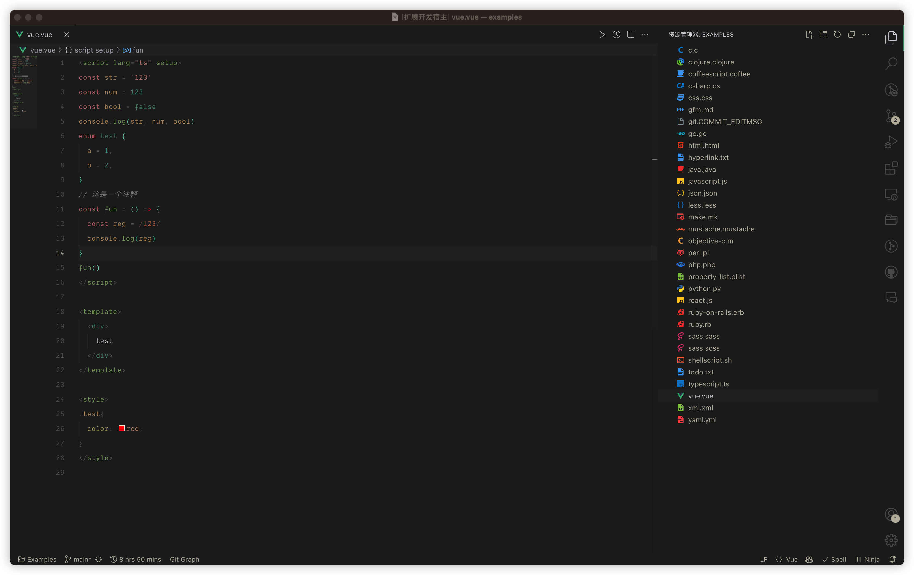

<h1 align="center">Kriszu Theme for VS Code</h1>

<p align="center">
<a href="https://marketplace.visualstudio.com/items?itemName=wangsizhu0504.kriszu-theme" target="__blank">
  
</a>
</p>

<p align="center">

</p>

## Match with System

<!--eslint-skip-->

```jsonc
// .vscode/setting.json
{
  "window.autoDetectColorScheme": true,
  "workbench.preferredLightColorTheme": "Kriszu Light",
  "workbench.preferredDarkColorTheme": "Kriszu Dark",
}
```

## Links

[prism-theme-vars](https://github.com/antfu/prism-theme-vars) - where the theme born.

[vitesse](https://github.com/antfu/vitesse) - what the theme was for.

## Thanks

This project is based on [vitesse](https://github.com/antfu/vitesse).

## License

MIT - Copyright (c) 2023 Kriszu
